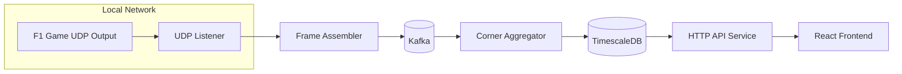
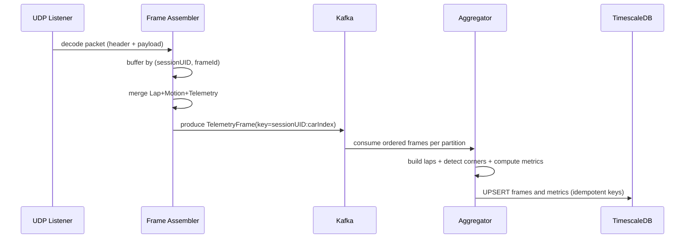

# Технічний дизайн: пер-кутовий аналіз швидкості з F1 25 UDP телеметрії з виводом у React

## Виконавчий підсумок

Функція будує **аналіз швидкості по кожному повороту (corner)** на основі UDP телеметрії: для кожного кола та кожного повороту обчислюються **entry / apex / exit швидкості**, **min/avg/max**, **профіль швидкості всередині повороту** (speed vs distance), і надаються API для відображення у React UI.

Ключова ідея: базова вісь синхронізації та «привʼязки до траси» — це **дистанція по колу** `LapData.m_lapDistance` (метри) замість часу. Поля швидкості/керма/бокових прискорень беруться із графу пакетів `PacketCarTelemetryData` та `PacketMotionData`, синхронізуються по `PacketHeader.m_frameIdentifier` (і `m_sessionUID`). citeturn2view2turn2view3turn2view4turn2view0

Оскільки UDP не дає «номера повороту», система формує **модель поворотів траси** як набір відрізків по `lapDistance` (start/end/apex distances), отриманих алгоритмічно (steer/G‑lateral/yaw/curvature) і стабілізованих/версіонованих на рівні `track_id + track_length`. `trackId` і `trackLength` беруться із `PacketSessionData`. citeturn12view3turn2view6

Архітектура: UDP Listener → Kafka (нормалізовані “frames”) → сервіс агрегації (corner segmentation + metrics) → TimescaleDB (raw frames + агрегати + довідники) → API → React. Стійкість до дублікатів/втрат UDP досягається ідемпотентними ключами (sessionUID+frameId+carIndex) і Upsert-стратегією, а в Kafka — ключуванням подій для гарантованого порядку в межах partition. citeturn4view0turn6search7turn6search17turn6search6

Явні припущення (бо не задано у запиті і не гарантується протоколом):
- Вибрана частота “Rate as specified in menus” типово 60 Hz, але може бути будь-яка підтримувана в меню/налаштуваннях; алгоритми мають адаптивні вікна/пороги. citeturn4view3turn10view3
- Аналіз за замовчуванням виконується для **player car** (`PacketHeader.m_playerCarIndex`), але схема підтримує всі активні машини (до 22). citeturn2view0turn5view0turn5view2
- `m_lapDistance` може бути негативною, доки не перетнута лінія старт/фініш; це враховується в детекції меж кола. citeturn2view2turn2view5


## Джерела даних UDP

### Потрібні пакети та поля

Всі пакети мають заголовок `PacketHeader` з полями синхронізації та ідентифікації. citeturn2view0turn5view0  
Кодування — **Little Endian**, структури **packed (без padding)**, типи визначені в документі. citeturn5view0turn5view1

Нижче — мінімальний набір для per-corner speed.

#### Порівняльна таблиця: пакети та точні поля

| Стадія | UDP Packet (ID) | Поля (точно як у специфікації) | Типи | Навіщо |
|---|---|---|---|---|
| Синхронізація | PacketHeader (в кожному пакеті) | `m_sessionUID`, `m_sessionTime`, `m_frameIdentifier`, `m_overallFrameIdentifier`, `m_packetId`, `m_playerCarIndex` | `uint64`, `float`, `uint32`, `uint32`, `uint8`, `uint8` | Кореляція подій між пакетами, робота з flashback (`m_overallFrameIdentifier` не відмотується назад) |
| Привʼязка до траси | PacketLapData (2) → LapData | `m_lapDistance`, `m_totalDistance`, `m_currentLapNum`, `m_currentLapInvalid`, `m_sector`, `m_driverStatus`, `m_resultStatus` | `float`, `float`, `uint8`, `uint8`, `uint8`, `uint8`, `uint8` | Вісь “метри по колу”, межі кола, фільтрація валідних кіл і стану машини |
| Швидкість/керування | PacketCarTelemetryData (6) → CarTelemetryData | `m_speed`, `m_throttle`, `m_steer`, `m_brake`, `m_gear` | `uint16`, `float`, `float`, `float`, `int8` | Speed vs distance, точки entry/exit, поведінка в повороті |
| Динаміка/геометрія | PacketMotionData (0) → CarMotionData | `m_worldPositionX`, `m_worldPositionZ`, `m_gForceLateral`, `m_yaw` | `float`, `float`, `float`, `float` | Curvature/yaw-rate методи детекції поворотів, апекс через max curvature |
| Метадані траси | PacketSessionData (1) | `m_trackId`, `m_trackLength`, `m_totalLaps`, `m_sector2LapDistanceStart`, `m_sector3LapDistanceStart` | `int8`, `uint16`, `uint8`, `float`, `float` | Ідентифікація треку, нормалізація дистанцій, допоміжні маркери секторів |
| Активні автомобілі | PacketParticipantsData (4) | `m_numActiveCars` | `uint8` | Обмеження масивів/візуалізацій (до 22) |

citeturn2view0turn3view2turn2view2turn2view5turn13view3turn13view4turn13view1turn2view3turn3view0turn13view0turn12view3turn5view2

### Частоти та припущення дискретизації

- `PacketSessionData` має частоту **2/сек**. citeturn10view0turn12view3  
- `PacketLapData`, `PacketMotionData`, `PacketCarTelemetryData` мають частоту **“Rate as specified in menus”** (керується налаштуваннями UDP). citeturn4view2turn2view4turn2view2turn2view3  
- Специфікація дає приклад при 60 Hz: на одному кадрі відправляються разом `Lap Data`, `Motion Data`, `Car Telemetry`, `Car Status`, `Motion Ex`, а також пояснює порядок “frame 1/frame 2”. citeturn4view3turn4view4turn4view1  
- Для пакетів, що оновлюються з “Rate as specified”, гарантується **відправка разом на одному кадрі** (але доставка по UDP не гарантована). citeturn4view0  

### Обмеження “Your Telemetry”

У multiplayer частина даних може бути занулена, якщо “Your Telemetry” = Restricted. Перелік занулених полів стосується, зокрема, `Car status packet`, `Car damage packet`, `Tyre set packet`. Це враховується як фактор доступності “додаткових” метрик, але базові `m_speed/m_steer` беруться з інших пакетів. citeturn14view0turn14view1


## Ingestion

### Протокол декодування та валідація

Декодування UDP пакетів:
- Endianness: **Little Endian**. citeturn5view0  
- Packed structs: **без padding**. citeturn5view1  
- Розбір типів `uint8/int8/uint16/int16/uint32/uint64/float/double`. citeturn5view0  
- Визначення типу пакета через `PacketHeader.m_packetId`. citeturn2view0turn11view1  
- Контроль формату: `m_packetFormat` = 2025, `m_gameYear` = 25. citeturn2view0turn5view0  

Валідація payload:
- Перевірка мінімального розміру та структури по `m_packetId` (захист від сміттєвих datagram).
- Перевірка `m_sessionUID` (перемикання сесій) і монотонності `m_overallFrameIdentifier` як сигналу flashback/rewind. citeturn2view0turn3view2  

### Стратегія синхронізації (Frame Assembler)

Оскільки потрібні поля приходять з різних пакетів, вводиться “Frame Assembler”, що агрегує дані в обʼєкт **TelemetryFrame** з ключем:

- `frame_key = (m_sessionUID, m_frameIdentifier, carIndex)` citeturn2view0turn4view1  

Джерела для TelemetryFrame:
- LapData: `m_lapDistance`, `m_currentLapNum`, `m_currentLapInvalid`, `m_driverStatus`, `m_resultStatus` citeturn2view2turn12view1turn13view3turn13view4  
- CarTelemetryData: `m_speed`, `m_steer`, `m_throttle`, `m_brake` citeturn2view3turn13view1turn13view2  
- CarMotionData: `m_worldPositionX`, `m_worldPositionZ`, `m_gForceLateral`, `m_yaw` citeturn2view4turn3view0  

Політика “complete vs partial”:
- На кадрі з “Rate as specified” пакети відправляються разом (синхронний snapshot). citeturn4view0turn4view2  
- Але UDP може втрачати датаграми, тому Assembler тримає буфер `TTL ~ 2–3 кадри` та маркує `is_partial=true`, якщо не вдалося зібрати весь набір. Факт UDP‑доставки і залежність від мережі прямо зазначені в документі. citeturn4view0  

### “Rate” як конфігурація

Частота відправки UDP керується меню/налаштуваннями, також згадано XML-атрибут `sendRate`. citeturn10view3turn10view2  
У сервісах ingestion обовʼязково фіксується поточна `sendRateAssumptionHz`, що використовується лише для таймаутів/фільтрації (не як “істина”).


## Сервіс обробки та агрегації

### Компонентна архітектура сервісів

Основні компоненти:
- **UDP Listener**: приймає datagrams, декодує, робить первинну валідацію `PacketHeader`.
- **Frame Assembler**: збирає TelemetryFrame по `m_frameIdentifier`.
- **Corner Model Builder**: формує/оновлює “corner map” для `trackId`.
- **Corner Metrics Aggregator**: для кожного кола обчислює метрики по кожному повороту та профіль швидкості.
- **Writer**: батч‑запис в TimescaleDB.

Стійкість:
- Вхід UDP може бути *at-most-once*. Надалі пайплайн робиться *at-least-once* з ідемпотентністю на рівні ключів подій та унікальних обмежень БД.
- Для Kafka‑транспорту (див. наступний розділ) використовуються ідемпотентні/транзакційні режими продюсерів/стрім‑процесингу як опція. Kafka описує idempotent producer і транзакції як механізми уникнення дублікатів та атомарності. citeturn6search6turn6search16turn8search16turn8search17  

### Алгоритми детекції поворотів

Задача: на вході маємо послідовність TelemetryFrame для одного `lap`, відсортовану по `m_lapDistance`. Вихід: список сегментів `[cornerStartDistance, cornerEndDistance]` + `apexDistance` (і опціонально direction).

#### Підготовка даних (спільна для всіх методів)

- Вісь дистанції: `d = m_lapDistance` (метри). citeturn2view2turn2view5  
- Вісь часу: `t = m_sessionTime` (секунди), для dt‑оцінок. citeturn2view0turn5view0  
- Валідація кола:
  - `m_currentLapInvalid == 0` (валідне) citeturn2view5turn12view1  
  - `m_driverStatus == 1` (flying lap) — як фільтр для аналізу, якщо потрібен “time trial/attack” режим. citeturn13view3  
- Корекція wrap-around:
  - якщо `d` стає негативною або різко падає — це перетин лінії або “ще не перетнув” (документ допускає негативні значення), тому використовується `m_currentLapNum` як первинний маркер сегментації кіл. citeturn2view2turn2view5  

#### Метод на основі керма (steer threshold)

Дані: `m_steer` з `CarTelemetryData` (діапазон [-1..1]). citeturn2view3turn3view5  

Сигнал:
- `S(d) = |m_steer|`

Сегментація:
- `S(d) > steer_on` запускає “corner candidate”
- `S(d) < steer_off` завершує (гістерезис щоб уникнути дрібних розривів)

Переваги:
- Простий, стабільний для поворотів, де кермо суттєво відхилене.

Обмеження:
- Високошвидкісні “легкі” повороти з малим кермом можуть зливатися зі straight.

#### Метод на основі бокового перевантаження (G‑lateral)

Дані: `m_gForceLateral` з `CarMotionData`. citeturn3view0turn13view0  

Сигнал:
- `G(d) = |m_gForceLateral|`

Сегментація:
- `G(d) > g_on` → corner
- `G(d) < g_off` → straight

Переваги:
- Краще ловить швидкі повороти, навіть при малому `m_steer`.

Обмеження:
- Може реагувати на агресивні переставки/керб.

#### Метод yaw‑rate (похідна yaw)

Дані: `m_yaw` (радіани) з `CarMotionData`. citeturn3view0turn13view0  

Оцінка:
- `yaw_rate ≈ unwrap(yaw[i]-yaw[i-1]) / dt`
- або геометрично стабільніше для привʼязки до дистанції:
  - `kappa_yaw ≈ unwrap(yaw[i]-yaw[i-1]) / max(dd, ε)`, де `dd = d[i]-d[i-1]`

Сегментація:
- `|kappa_yaw| > kappa_on` → поворот
- `|kappa_yaw| < kappa_off` → пряма

Перевага:
- Дає “кривизну” без координат.

#### Метод curvature по world-координатах

Дані: `m_worldPositionX`, `m_worldPositionZ` (метри). citeturn2view4turn3view0  

Оцінка кривизни на дискретних точках полілайну (на рівні трьох послідовних точок):
- `p0, p1, p2` → кут між векторами `(p1-p0)` і `(p2-p1)`
- `curvature ≈ angle / arc_length`, де `arc_length ≈ |p1-p0| + |p2-p1|`

Сегментація:
- Поріг `curvature > c_on` (з гістерезисом)

Переваги:
- Не залежить від моделі керма/підсилювача.
- Дає кращий “apex” через максимум curvature.

Обмеження:
- Чутливий до шуму і дрібних коливань позиції; потрібне згладжування по вікну N кадрів.

#### Комбінований “production” детектор

Практичний інтегрований критерій:
- `corner_signal = wS*|steer| + wG*|gLat| + wK*|kappa_yaw| + wC*curvature`
- Валідація corner segment: мінімальна довжина сегмента по дистанції (наприклад ≥ 20–50 м) та мінімальна кількість точок.

Факт, що “Rate as specified” пакети приходять як узгоджений snapshot одного кадру, дозволяє коректно змішувати сигнали з різних пакетів в одному TelemetryFrame. citeturn4view0  

### Побудова “corner map” (стабільна привʼязка до поворотів)

Мета UI: не просто “сегменти”, а **стабільні Corner ID** по треку.

Пропозиція:
- Для кожного `(trackId, trackLength)` з `PacketSessionData` створюється версія `corner_map_version`. citeturn12view3  
- “Corner Model Builder” на основі перших N валідних flying laps:
  - детектує corner segments на кожному колі
  - кластеризує сегменти по `apexDistance` (або `startDistance`) у групи → це і є повороти
  - стабілізує `start/end` як медіану/квантілі.
- Зберігає `corner_index` (1..K) і опційний `name` (наприклад “T1”), який може конфігуруватися вручну (бо протокол не несе людських назв поворотів).

Використання секторних стартів (`m_sector2LapDistanceStart`, `m_sector3LapDistanceStart`) може служити “якорем” для валідації (повороти мають лежати в межах [0..trackLength], а розподіл по секторах не має розʼїжджатися). citeturn12view1turn12view3  

### Метрики агрегації по повороту

Для кожного `(lap_id, corner_id)` обчислюються:

- `entry_speed_kph`: швидкість на `corner.start_distance_m` (інтерполяція по distance) з `m_speed`. citeturn2view3turn13view1  
- `apex_speed_kph`: мінімальна `m_speed` в сегменті (або speed при max curvature). citeturn2view3turn2view4turn3view0  
- `exit_speed_kph`: швидкість на `corner.end_distance_m`. citeturn2view3  
- `min/avg/max_speed_kph`: по всіх точках сегмента. citeturn2view3  
- `corner_duration_ms`: інтеграція по dt (`m_sessionTime`) в межах сегмента. citeturn2view0turn5view0  
- `speed_profile`: resampling `speed(d)` до фіксованих bins (наприклад 50 або 100 значень на сегмент) для overlay між колами.

Ресемплінг узгоджує різну дискретизацію (через змінний `sendRate`), оскільки базова вісь — distance. Частоти передачі та “rate” вказані як конфігураційні. citeturn4view2turn10view3turn10view2  

### Цілі продуктивності (SLO, проєктні)

- End‑to‑end latency (UDP → API доступність агрегації per lap): ≤ 2 c після завершення кола.
- Ingestion throughput: до 60 Hz * 22 cars * 3 пакети (lap+telemetry+motion) без деградації (з запасом), але з можливістю зберігати лише player car як режим оптимізації.
- API p95 для запиту `lap corners metrics`: ≤ 150 ms при warm cache; `profile` ≤ 250 ms (payload домінує).
- Kafka consumer lag: стабільно < 1–2 секунди в steady state.


## Схема зберігання

### Kafka: topics, keying, partitions, retention

Kafka гарантує порядок **в межах partition**, а partitioning може базуватись на ключі запису. citeturn6search7turn6search17turn8search3  
Ключування повідомлень потрібне, щоб всі кадри одного авто в межах сесії йшли послідовно.

#### Порівняльна таблиця: Kafka topics

| Topic | Тип подій | Key | Partitions | Retention/cleanup | Споживачі |
|---|---|---|---:|---|---|
| `f1udp.frames.v1` | Нормалізований TelemetryFrame (обʼєднані поля з Lap/Motion/Telemetry) | `sessionUID + ":" + carIndex` | 12–24 | `delete` 1–7 днів | Aggregator, optional replay tools |
| `f1udp.lap-events.v1` | `LAP_START/LAP_END` + службові дані (lap_id, lap_num) | `sessionUID + ":" + carIndex` | 12–24 | `compact` (останній стан lap по ключу) або `delete` 30 днів | API cache warmer, offline analytics |
| `f1udp.corner-metrics.v1` | Corner metrics per lap (entry/apex/exit/min/avg/max + profile ref) | `lap_id` | 12 | `delete` 90 днів | DB writer, API precompute |

Kafka retention policy “delete/compact” і їх комбінування задаються через topic configs (`cleanup.policy`). citeturn8search2turn8search9  
Параметр partition count впливає на parallelism consumers (один consumer може обробляти кілька partitions, але максимальний паралелізм обмежений кількістю partitions). citeturn6search21

Ідемпотентність/дублікати:
- Увімкнення `enable.idempotence=true` для продюсерів зменшує ризик дублікатів при retries; Kafka описує умови роботи idempotence і сенс “exactly one copy”. citeturn6search16turn6search6  
- Для stronger гарантій end‑to‑end можна застосувати транзакції/Streams exactly-once (опційно) — Kafka описує транзакції як спосіб атомарно писати output і commit offsets. citeturn8search16turn8search17turn8search5

Довговічність:
- `acks=all` та `min.insync.replicas` використовуються для посилення durability; Kafka документує гарантії для `acks=all` і сценарій з `min.insync.replicas`. citeturn8search15turn8search1turn8search21

### TimescaleDB: таблиці, hypertables, політики

TimescaleDB використовує hypertable як примітив для time-series партиціювання. `create_hypertable()` вимагає, щоб time column була `NOT NULL`. citeturn15search3turn6search4  
Унікальні індекси на hypertable мають включати **всі partitioning columns**. Це важливо для ідемпотентності через `UNIQUE(session_uid, car_index, frame_identifier, time)` або подібне. citeturn15search10  

#### Порівняльна таблиця: DB таблиці

| Таблиця | Тип | Ключ/унікальність | Основні колонки | Призначення |
|---|---|---|---|---|
| `sessions` | звичайна | `session_uid PK` | `session_uid (uuid/bigint)`, `track_id (int)`, `track_length_m (int)`, `udp_format (int)`, `started_at (timestamptz)` | Метадані сесії |
| `telemetry_frames` | hypertable | UNIQUE (partition-aware) | `ts (timestamptz NOT NULL)`, `session_uid`, `car_index`, `frame_identifier`, `overall_frame_identifier`, `session_time_s`, `lap_num`, `lap_distance_m`, `speed_kph`, `steer`, `brake`, `throttle`, `g_lat`, `yaw`, `pos_x`, `pos_z`, `is_partial` | Raw frames для реконструкції профілю/алгоритмів |
| `laps` | звичайна або hypertable | `lap_id PK`, UNIQUE(session_uid, car_index, lap_num) | `lap_id`, `session_uid`, `car_index`, `lap_num`, `lap_start_ts`, `lap_end_ts`, `is_valid`, `lap_time_ms` | Межі кола та його атрибути |
| `track_corner_maps` | звичайна | UNIQUE(track_id, track_length_m, version) | `track_id`, `track_length_m`, `version`, `created_at`, `algorithm_params jsonb` | Версії “карти поворотів” |
| `track_corners` | звичайна | UNIQUE(map_id, corner_index) | `map_id`, `corner_index`, `start_distance_m`, `end_distance_m`, `apex_distance_m`, `direction`, `name` | Стабільні сегменти поворотів |
| `lap_corner_metrics` | звичайна або hypertable | UNIQUE(lap_id, corner_index) | `lap_id`, `corner_index`, `entry_speed_kph`, `apex_speed_kph`, `exit_speed_kph`, `min_speed_kph`, `avg_speed_kph`, `max_speed_kph`, `duration_ms`, `apex_distance_m` | Агреговані метрики |
| `lap_corner_profiles` | звичайна | UNIQUE(lap_id, corner_index, bins) | `lap_id`, `corner_index`, `bins`, `speed_kph real[]`, `distance_m real[]` | Профіль speed vs distance (ресемпл) |

Поля “trackId/trackLength” беруться з `PacketSessionData`. citeturn12view3turn2view6  
Поля “frameIdentifier/sessionUID/sessionTime” беруться з `PacketHeader`. citeturn2view0turn5view0  
Raw speed/steer/brake/throttle — з `CarTelemetryData`. citeturn13view1turn2view3  
Yaw/G‑lateral/позиції — з `CarMotionData`. citeturn3view0turn2view4  

### Політики retention/compression та агрегати

Retention policy:
- `add_retention_policy()` створює фонове завдання для видалення chunks старше інтервалу; дозволено лише одну retention policy на hypertable. citeturn7search0turn7search4  

Compression policy:
- `add_compression_policy()` стискає chunks старше `compress_after`; описано як інтервал “now - compress_after”. citeturn7search1turn7search25  

Continuous aggregates:
- Побудова (опційно) для dashboard‑рівня статистики по поворотах “за останні N хв/кіл”, але не замінює per‑lap детальні агрегати.
- Continuous aggregates вимагають `time_bucket` на time колонці. citeturn6search30turn7search3  
- У документації є важливі застереження про взаємодію retention і refresh window continuous aggregates (щоб не втратити агрегати при drop raw). citeturn6search0turn7search8turn6search1  

Проєктна політика (приклад):
- `telemetry_frames`: retention 7–14 днів, compression після 1–3 днів.
- `lap_corner_metrics`/`profiles`: retention 6–12 місяців (можна без compression або з менш агресивним compress_after).

Часова колонка `ts`:
- `ts` формується як `session_wallclock_start + m_sessionTime` (стабільне відношення sessionTime→timestamptz). `m_sessionTime` визначено в `PacketHeader`. citeturn2view0turn5view0  


## API дизайн

### Принципи

- Основні запити UI працюють по домен-ідентифікаторах: `session_uid`, `lap_id`, `corner_index`.
- Дані “профілю” віддаються вже **ресемпленими** (щоб фронтенд не тягнув raw frames).
- Всі REST відповіді містять `schemaVersion`, щоб еволюціонувати без поломок.

### Порівняльна таблиця: ендпоїнти

| Endpoint | Метод | Призначення | Основні параметри |
|---|---:|---|---|
| `/api/sessions` | GET | Список сесій | `from`, `to`, `trackId` |
| `/api/sessions/{sessionUid}` | GET | Метадані сесії | — |
| `/api/sessions/{sessionUid}/laps` | GET | Список кіл | `carIndex`, `onlyValid` |
| `/api/laps/{lapId}` | GET | Деталі кола | — |
| `/api/laps/{lapId}/corners` | GET | Метрики по поворотах для кола | `mapVersion?` |
| `/api/laps/{lapId}/corners/{cornerIndex}/profile` | GET | Профіль speed vs distance | `bins=50|100`, `smooth=true|false` |
| `/api/tracks/{trackId}/corner-maps/latest` | GET | Остання карта поворотів | `trackLength?` |
| `/api/tracks/{trackId}/corner-maps/{version}` | GET | Конкретна карта поворотів | `trackLength` |

### JSON приклади

#### `GET /api/laps/{lapId}/corners`

Відповідь:

```json
{
  "schemaVersion": "1.0",
  "lap": {
    "lapId": "9d9b2d7a-0ac4-4b62-8bde-5d6b2c12dfb7",
    "sessionUid": "0x8f3b2e1c4a5d7781",
    "carIndex": 0,
    "lapNum": 12,
    "isValid": true,
    "trackId": 10,
    "trackLengthM": 5312
  },
  "cornerMap": {
    "version": 3,
    "cornerCount": 16
  },
  "corners": [
    {
      "cornerIndex": 1,
      "name": "T1",
      "startDistanceM": 120.5,
      "apexDistanceM": 170.0,
      "endDistanceM": 260.0,
      "entrySpeedKph": 305.2,
      "apexSpeedKph": 138.4,
      "exitSpeedKph": 225.7,
      "minSpeedKph": 138.4,
      "avgSpeedKph": 190.1,
      "maxSpeedKph": 312.0,
      "durationMs": 4250
    }
  ]
}
```

Джерела полів:
- `trackId/trackLength` — `PacketSessionData.m_trackId/m_trackLength`. citeturn12view3turn2view6  
- `lapDistance` — `LapData.m_lapDistance`. citeturn2view2  
- speed/steer/brake/throttle — `CarTelemetryData.*`. citeturn13view1  

#### `GET /api/laps/{lapId}/corners/{cornerIndex}/profile?bins=50`

```json
{
  "schemaVersion": "1.0",
  "lapId": "9d9b2d7a-0ac4-4b62-8bde-5d6b2c12dfb7",
  "cornerIndex": 1,
  "bins": 50,
  "distanceM": [0.0, 2.8, 5.6, 8.4, 11.2],
  "speedKph": [305.2, 298.1, 284.0, 260.5, 238.2],
  "markers": {
    "entryBin": 0,
    "apexBin": 22,
    "exitBin": 49
  }
}
```

Пояснення:
- `distanceM` — локальна шкала від `startDistance` (0) до `endDistance-startDistance`.
- `speedKph` — ресемпл з raw `m_speed` по `m_lapDistance`. citeturn2view3turn2view2  

### Валідація та синхронізація на рівні API

- Якщо `lap` має `isValid=false` (з `m_currentLapInvalid`), API або приховує його за `onlyValid=true`, або повертає з відповідним прапором. citeturn12view1turn2view5  
- Якщо агрегація виконана на partial frames (`is_partial=true`), API включає `quality` з “coverage” (частка кадрів, що містили всі поля).


## Frontend візуалізація та UX

### Основні UI екрани

- **Session Overview**: список сесій, вибір треку/дати.
- **Lap Browser**: таблиця кіл з фільтрами (valid only, lapNum, carIndex).
- **Corner Dashboard**: список поворотів з entry/apex/exit, сортування по apex speed або delta до best lap.
- **Corner Detail**: графік speed profile для одного повороту з overlay кількох кіл.
- **Track Map**: 2D схема траси (polyline з `worldPositionX/Z`) з підсвічуванням обраного повороту.

Дані для track map:
- `m_worldPositionX/Z` в метрах (Motion). citeturn2view4turn3view0  
- Сесійний `trackLength` використовується лише для distance‑нормалізації, не для геопривʼязки. citeturn12view3turn2view6  

### Структура React компонентів

Компонентна декомпозиція (TypeScript):

- `AppShell`
  - `SessionListPage`
    - `SessionCard`
  - `SessionDetailPage`
    - `LapTable`
      - `LapRow`
    - `CornerDashboard`
      - `CornerMetricsTable`
      - `CornerMetricsRow`
    - `CornerDetailDrawer`
      - `CornerSpeedChart`
      - `CornerStatsPanel`
    - `TrackMapPanel`
      - `TrackPolylineCanvas`
      - `CornerOverlay`

State management:
- `server state`: caching/fetching через **TanStack Query** (React Query) — щоб уникати ручного кешування і стабільно працювати з refetch.
- `ui state`: lightweight store (наприклад Zustand) для `selectedLapIds`, `selectedCornerIndex`, `mapVersion`, `bins`, `smoothing`.

### Візуалізація графіків

Ціль: швидке рендерення профілів (50–300 точок на кут) та overlay 3–10 кіл.

Рекомендований формат даних для графіка:
- `distanceM[]` (x)
- `speedKph[]` (y)
- `markers` (entry/apex/exit)

Приклад ASCII-плоту (схематично):

```text
Speed (kph)
320 |\
300 | \__
280 |    \__
260 |       \___
240 |          \_____
220 |                \____
200 |                     \___
180 |                        \____
160 |                             \____
140 |                                  \__
    +----------------------------------------> Distance inside corner (m)
      entry             apex                 exit
```

У React:
- `CornerSpeedChart` будує 2 серії: “поточне коло” + “best lap” (опціонально).
- При hover — tooltip: `distance`, `speed`, `delta vs best` на відповідному bin.

### UX деталі “привʼязки до поворотів”

- Клік по рядку повороту → відкриття Detail + підсвічення сегмента на Track Map.
- Перемикач “Corner map version” для діагностики (якщо алгоритм кластеризації оновив межі).
- Індикація якості даних: coverage %, partial frames, вибір “exclude partial” для чистих порівнянь.

Performance цілі фронтенду:
- payload `/profile?bins=50`: < 10 KB на один поворот (2 масиви по 50 чисел + метадані).
- До 16 поворотів * 2 кола overlay → < 400 KB при одному відкритому екрані (типова межа без фризів).


## Розгортання, операції, спостережуваність і безпека

### Mermaid: системна архітектура



Факти протоколу, що впливають на архітектуру:
- UDP на стороні гри конфігурується в меню (IP/port/broadcast/send rate). citeturn10view3turn10view2  
- На першому кадрі (session timestamp 0.000) відправляються основні пакети для ініціалізації (Session/Participants/Car Setups/Lap Data/Motion/Telemetry/Status/Damage/Motion Ex). citeturn4view3  

### Mermaid: data flow та ідемпотентність



Обґрунтування порядку:
- Kafka забезпечує порядок читання **в межах topic-partition**, що відповідає вибраному key (sessionUID+carIndex). citeturn6search7turn8search28turn6search17  
- Коміти offsets — відновлюваний “committed position”, який описаний у документації Kafka consumer. citeturn8search7turn8search14  

### Моніторинг та алерти

Метрики ingestion:
- UDP packets/sec по `packetId`
- decode errors (%)
- frame assembly completeness (% frames with all required fields)
- gap/drops: різниця `m_frameIdentifier` (детектор пропусків кадрів) citeturn2view0turn5view0  

Kafka:
- consumer lag per topic/partition
- under-replicated partitions
- produce errors (acks failures). Налаштування durability через `acks=all` і `min.insync.replicas` — документовано. citeturn8search15turn8search1  

TimescaleDB:
- write latency, batch size
- chunk count/size по `telemetry_frames`
- jobs status for retention/compression (оскільки retention/compression реалізуються як фонова політика). citeturn7search0turn7search1turn7search25  

API:
- p50/p95 latency per endpoint
- DB query time
- cache hit ratio

Алерти:
- frame completeness < 90% протягом 1 хв
- API p95 > 500 ms (дефект індексів/планів)
- consumer lag > 10 s
- ретеншн/компресія job failures

### Безпека

UDP surface:
- Прийом UDP лише з дозволених IP (allowlist), firewall на порт.
- Якщо broadcast включений — сегментація мережі/VLAN, щоб уникати небажаного flood. Broadcast режим і настройки IP/port згадані в документі. citeturn10view3  

HTTP/API:
- TLS.
- Аутентифікація (JWT/OAuth2) для multi-user інсталяцій.
- Rate limiting на “профільні” ендпоїнти (бо вони дають найбільші payload).

Дані multiplayer:
- Врахування, що “Your Telemetry” може занулювати чутливі поля для інших гравців; API має не робити припущень про наявність полів поза `CarTelemetry/Motion/Lap`. citeturn14view0turn14view1  

### Deployment

Рекомендована форма:
- Контейнери (Docker) для UDP Listener, Aggregator, API.
- Kafka cluster (мін. 3 брокери для production), replication factor 3, налаштування `acks=all`/`min.insync.replicas=2` для тем з критичними даними. citeturn8search1turn8search15turn6search21  
- TimescaleDB як окремий stateful сервіс; включені retention/compression політики (`add_retention_policy`, `add_compression_policy`). citeturn7search0turn7search1