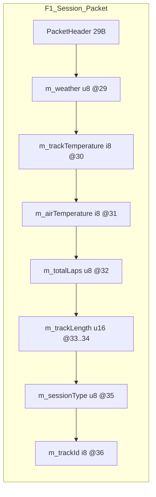

# Офіційні UDP-телеметрійні протоколи гоночних ігор: тип сесії та ідентифікатор траси

## Виконавче резюме

Для entity["video_game","F1 25","formula one racing game 2025"] доступний офіційний документ «Data Output from F1 25 Game», у якому явно зафіксовано: усі значення кодуються у форматі little-endian, а структури даних упаковані (без паддінгу); тип сесії (`m_sessionType`) і ідентифікатор траси (`m_trackId`, `-1` означає «невідомо») знаходяться у Session packet, а їхні повні таблиці значень наведені в апендиксах. citeturn9search0turn5view3turn6view0turn7view0

Для entity["video_game","F1 23","formula one racing game 2023"] (як один із попередніх форматів, які entity["company","Electronic Arts","video game publisher"] і entity["company","Codemasters","video game developer"] продовжують підтримувати в наступних релізах) у відтвореній специфікації наведено ті самі ключові поля `m_sessionType` та `m_trackId` у `PacketSessionData`, разом із переліком Track IDs, але з іншою нумерацією session types та ширшим списком трас у відповідному апендиксі. citeturn9search0turn12view0turn12view3

Для entity["video_game","Assetto Corsa Competizione","racing simulator 2019"] первинним джерелом є broadcasting SDK (файли `BroadcastingNetworkProtocol.cs`, `BroadcastingEnums.cs`, `TrackData.cs` тощо), який постачається зі Steam-інструментом Dedicated Server і містить еталонну реалізацію UDP-протоколу на рівні байтового розбору повідомлень; коди «типу гонки/сесії» визначені через `RaceSessionType` (byte), а ідентифікатор траси передається через `TrackData` як пара `TrackName` (рядок UTF‑8 з довжиною `UInt16`) та `TrackId` (`Int32`), без опублікованої в цьому SDK таблиці відповідності `TrackId → назва`. citeturn22search8turn24view0turn24view1turn24view2

Для entity["video_game","Project CARS 2","racing simulator 2017"] офіційні веб-сторінки з API/прикладами, на які посилаються старі інструкції, наразі відсутні; у публічному доступі лишилися заголовкові файли `SMS_UDP_Definitions.hpp`, які описують структури UDP-пакетів, включно з полями ідентифікації траси (`sTrackLocation`, `sTrackVariation`, а також «translated» варіанти) з фіксованими байтовими офсетами. Поле «тип сесії» в сенсі Practice/Qualifying/Race у цьому заголовку не подано як готовий перелік кодів: коментар вказує, що `mGameState` містить підполя (game state enum і session state enum), але самі таблиці значень винесені в інший shared memory header, який у цьому файлі відсутній. citeturn30search3turn31view0turn32view1turn32view4

## Методологія та критерії офіційності

Оскільки гра не задана, дослідження виконано за принципом «поширені гоночні ігри з відомими UDP-інтерфейсами», із фокусом на джерела, які є первинними (developer/publisher docs або SDK/вихідний код, що постачається розробником у складі гри/серверних інструментів), та вторинними (дзеркала/копії на entity["organization","GitHub","code hosting platform"]). citeturn9search0turn22search8turn11view0turn23view0

Критерії відбору джерел:
- Документ/SDK має походити з офіційних каналів розповсюдження (наприклад, PDF зі службових доменів форумів видавця або файли SDK, наявність яких можна підтвердити у складі офіційного depot/пакета). citeturn9search0turn22search8
- Якщо первинний веб-ресурс деактивовано (випадок Project CARS екосистеми), використовується збережена копія заголовка/SDK із явною вказівкою джерела походження та фіксацією прогалин (відсутні таблиці enum тощо). citeturn30search3turn31view0turn32view4

## UDP-телеметрія F1: поля типу сесії та ідентифікатор траси

### Структурний контекст і кодування

Офіційна специфікація entity["video_game","F1 25","formula one racing game 2025"] визначає, що всі UDP-поля кодуються little-endian і що структури є packed (без паддінгу). citeturn9search0

У Session packet (`PacketSessionData`) наявні:
- `m_sessionType` (`uint8`): тип сесії; значення наведені в апендиксі. citeturn5view3turn6view0
- `m_trackId` (`int8`): ідентифікатор траси; `-1` означає «unknown», список ID — в апендиксі. citeturn5view3turn7view0

Також специфікація фіксує, що entity["video_game","F1 25","formula one racing game 2025"] підтримує лише два попередні формати UDP (2024 і 2023), які можна обрати в налаштуваннях «UDP Format». citeturn9search0

### Офсети і типи для `m_sessionType` та `m_trackId` у Session packet (F1 25)

У `PacketSessionData` поля до `m_sessionType` та `m_trackId` (після `PacketHeader`) йдуть у фіксованому порядку: `m_weather (uint8)`, `m_trackTemperature (int8)`, `m_airTemperature (int8)`, `m_totalLaps (uint8)`, `m_trackLength (uint16)`, далі `m_sessionType (uint8)` і `m_trackId (int8)`. citeturn5view3

Оскільки специфікація одночасно задає packed-структури та типи в `PacketHeader`, байтові офсети можна отримати прямим складанням розмірів полів заголовка і попередників. citeturn9search0turn5view3

**Розклад офсетів (обчислено з визначень типів у документі):**
- `m_sessionType`: offset **35**, type `uint8`, endianness N/A (1 байт)  
- `m_trackId`: offset **36**, type `int8`, endianness N/A (1 байт)  

Пояснення для цих офсетів: `PacketHeader` містить 29 байтів полів (сума розмірів типів у заголовку) і далі йдуть 6 байтів до `m_sessionType` включно (`m_weather`..`m_trackLength`). Це узгоджується з тим, що документ визначає packed-структури і фіксований порядок полів. citeturn9search0turn5view3

### Коди `m_sessionType` (F1 25)

Нижче наведено повний перелік «Session types» із апендикса специфікації entity["video_game","F1 25","formula one racing game 2025"]. citeturn6view0

| Code | Name | Опис/контекст | Value type | Приклад значення |
|---:|---|---|---|---|
| 0 | Unknown | Невідомий тип сесії | `uint8` | 0 |
| 1 | Practice 1 | Вільна практика 1 | `uint8` | 1 |
| 2 | Practice 2 | Вільна практика 2 | `uint8` | 2 |
| 3 | Practice 3 | Вільна практика 3 | `uint8` | 3 |
| 4 | Short Practice | Скорочена практика | `uint8` | 4 |
| 5 | Qualifying 1 | Кваліфікація 1 | `uint8` | 5 |
| 6 | Qualifying 2 | Кваліфікація 2 | `uint8` | 6 |
| 7 | Qualifying 3 | Кваліфікація 3 | `uint8` | 7 |
| 8 | Short Qualifying | Скорочена кваліфікація | `uint8` | 8 |
| 9 | One-Shot Qualifying | Одне коло (one-shot) | `uint8` | 9 |
| 10 | Sprint Shootout 1 | Sprint Shootout 1 | `uint8` | 10 |
| 11 | Sprint Shootout 2 | Sprint Shootout 2 | `uint8` | 11 |
| 12 | Sprint Shootout 3 | Sprint Shootout 3 | `uint8` | 12 |
| 13 | Short Sprint Shootout | Скорочений Sprint Shootout | `uint8` | 13 |
| 14 | One-Shot Sprint Shootout | One-shot Sprint Shootout | `uint8` | 14 |
| 15 | Race | Гонка | `uint8` | 15 |
| 16 | Race 2 | Гонка 2 | `uint8` | 16 |
| 17 | Race 3 | Гонка 3 | `uint8` | 17 |
| 18 | Time Trial | Time Trial | `uint8` | 18 |

### Коди `m_trackId` (F1 25)

Нижче наведено повний перелік «Track IDs» із апендикса специфікації entity["video_game","F1 25","formula one racing game 2025"] (у документі частина чисел пропущена, тобто різні значення не обов’язково утворюють суцільний діапазон). citeturn7view0

| Code | Name | Опис/контекст | Value type | Приклад значення |
|---:|---|---|---|---|
| -1 | Unknown | Значення «невідомо» для `m_trackId` | `int8` | -1 |
| 0 | Melbourne | Траса Melbourne | `int8` | 0 |
| 2 | Shanghai | Траса Shanghai | `int8` | 2 |
| 3 | Sakhir (Bahrain) | Траса Sakhir (Bahrain) | `int8` | 3 |
| 4 | Catalunya | Траса Catalunya | `int8` | 4 |
| 5 | Monaco | Траса Monaco | `int8` | 5 |
| 6 | Montreal | Траса Montreal | `int8` | 6 |
| 7 | Silverstone | Траса Silverstone | `int8` | 7 |
| 9 | Hungaroring |_queries? Actually list contains 9 Hungaroring | `int8` | 9 |
| 10 | Spa | Траса Spa | `int8` | 10 |
| 11 | Monza | Траса Monza | `int8` | 11 |
| 12 | Singapore | Траса Singapore | `int8` | 12 |
| 13 | Suzuka | Траса Suzuka | `int8` | 13 |
| 14 | Abu Dhabi | Траса Abu Dhabi | `int8` | 14 |
| 15 | Texas | Траса Texas | `int8` | 15 |
| 16 | Brazil | Траса Brazil | `int8` | 16 |
| 17 | Austria | Траса Austria | `int8` | 17 |
| 19 | Mexico | Траса Mexico | `int8` | 19 |
| 20 | Baku (Azerbaijan) | Траса Baku (Azerbaijan) | `int8` | 20 |
| 26 | Zandvoort | Траса Zandvoort | `int8` | 26 |
| 27 | Imola | Траса Imola | `int8` | 27 |
| 29 | Jeddah | Траса Jeddah | `int8` | 29 |
| 30 | Miami | Траса Miami | `int8` | 30 |
| 31 | Las Vegas | Траса Las Vegas | `int8` | 31 |
| 32 | Losail | Траса Losail | `int8` | 32 |
| 39 | Silverstone (Reverse) | Reverse-варіант траси | `int8` | 39 |
| 40 | Austria (Reverse) | Reverse-варіант траси | `int8` | 40 |
| 41 | Zandvoort (Reverse) | Reverse-варіант траси | `int8` | 41 |

### Порівняння з форматом F1 23

Специфікація, відтворена для entity["video_game","F1 23","formula one racing game 2023"], також має `PacketSessionData` з `m_sessionType` (`u8`) та `m_trackId` (`i8`, `-1` — unknown). citeturn12view0

**Коди `m_sessionType` (F1 23) у документі задані як список у коментарі до поля:**
0=unknown, 1=P1, 2=P2, 3=P3, 4=Short P, 5=Q1, 6=Q2, 7=Q3, 8=Short Q, 9=OSQ, 10=R, 11=R2, 12=R3, 13=Time Trial. citeturn12view0turn14view4

**Track IDs (F1 23)** містять ширший широкий перелік трас (включно з Paul Ricard, Hockenheim, Sochi, короткими конфігураціями та Hanoi тощо). citeturn12view3

Ключова відмінність між кодуванням session types у 2023 і 2025 форматах полягає у перенумерації верхніх значень: у F1 23 «Race» має код 10, тоді як у F1 25 «Race» має код 15 і введено проміжний блок кодів для Sprint Shootout. citeturn12view0turn6view0



Схема ґрунтується на визначенні полів `PacketSessionData`, твердженні про packed-структури та типах у `PacketHeader`, які наведені у специфікації. citeturn9search0turn5view3

## UDP Broadcasting API Assetto Corsa Competizione: тип сесії та ідентифікатор траси

### Джерело протоколу та формат повідомлень

В офіційному складі dedicated server/tool для entity["video_game","Assetto Corsa Competizione","racing simulator 2019"] присутні вихідні файли broadcasting SDK (`BroadcastingNetworkProtocol.cs`, `BroadcastingEnums.cs`, структури `RealtimeUpdate`, `TrackData` тощо), що підтверджується переліком файлів у Steam depot. citeturn22search8

У `BroadcastingNetworkProtocol.cs` протокол описаний як набір UDP-повідомлень з:
- 1-байтовим типом повідомлення на початку;
- подальшим розбором полів через `BinaryReader` (`ReadUInt16`, `ReadInt32`, `ReadSingle`, `ReadByte` тощо);
- рядками, що читаються функцією `ReadString`: довжина `UInt16` + байти, які декодуються як UTF‑8. citeturn24view0

### Поля, пов’язані з «типом гонки/сесії»

Код «типу сесії» у live-оновленнях передається як `RaceSessionType` (byte) і читається в `InboundMessageTypes.REALTIME_UPDATE` як `update.SessionType = (RaceSessionType)br.ReadByte();`. citeturn24view0turn24view3

У `BroadcastingEnums.cs` визначено повний перелік значень `RaceSessionType`. citeturn24view1

| Code | Name (enum) | Опис (за назвою enum) | Value type | Приклад значення |
|---:|---|---|---|---|
| 0 | Practice | Практика | `byte` | 0 |
| 4 | Qualifying | Кваліфікація | `byte` | 4 |
| 9 | Superpole | Суперпул/суперпоуул | `byte` | 9 |
| 10 | Race | Гонка | `byte` | 10 |
| 11 | Hotlap | Hotlap | `byte` | 11 |
| 12 | Hotstint | Hotstint | `byte` | 12 |
| 13 | HotlapSuperpole | HotlapSuperpole | `byte` | 13 |
| 14 | Replay | Replay | `byte` | 14 |

Окремо в «ACC Server Admin Handbook» наведено мінімальний перелік session types (0 Practice, 4 Qualifying, 10 Race) у контексті серверної документації; ці значення збігаються з відповідними елементами `RaceSessionType` в SDK, але handbook не охоплює додаткові типи (Superpole/Hotlap/Replay тощо), які присутні в broadcasting enum. citeturn25view1turn24view1

### Поля, пов’язані з ідентифікатором траси

Для траси використовується повідомлення `InboundMessageTypes.TRACK_DATA`, де `TrackData` заповнюється як:
- `TrackName` (рядок),
- `TrackId` (`Int32`),
- `TrackMeters` (у коді читається як `Int32`, тоді як у структурі оголошено `float`),  
а далі передаються набори камер і HUD-сторінки. citeturn24view0turn24view2

Це джерело містить **типи полів** (`TrackName`, `TrackId`) і механіку кодування рядка (довжина `UInt16` + UTF‑8), але **не містить** таблиці відповідності `TrackId → назва траси`; фактична «людська» ідентифікація в протоколі гарантовано присутня як `TrackName`. citeturn24view0turn24view2

**Таблиця track identifiers у server handbook (значення поля `track` в server JSON-конфігурації):** наведено перелік рядкових значень (наприклад, `monza`, `spa`, `nurburgring_24h` тощо) разом з лімітом pit boxes/slot counts; handbook не описує їх як UDP-поля, але це первинне джерело переліку track-string значень, які використовуються в екосистемі ACC. citeturn25view0

| Code (string) | Name | Опис/контекст | Value type | Приклад |
|---|---|---|---|---|
| monza | Monza | Track value у handbook (JSON конфіг) | `string` | `"monza"` |
| zolder | Zolder | Track value у handbook | `string` | `"zolder"` |
| brands_hatch | Brands Hatch | Track value у handbook | `string` | `"brands_hatch"` |
| silverstone | Silverstone | Track value у handbook | `string` | `"silverstone"` |
| paul_ricard | Paul Ricard | Track value у handbook | `string` | `"paul_ricard"` |
| misano | Misano | Track value у handbook | `string` | `"misano"` |
| spa | Spa | Track value у handbook | `string` | `"spa"` |
| nurburgring | Nurburgring | Track value у handbook | `string` | `"nurburgring"` |
| barcelona | Barcelona | Track value у handbook | `string` | `"barcelona"` |
| hungaroring | Hungaroring | Track value у handbook | `string` | `"hungaroring"` |
| zandvoort | Zandvoort | Track value у handbook | `string` | `"zandvoort"` |
| kylami | Kyalami | Track value у handbook | `string` | `"kylami"` |
| mount_panorama | Mount Panorama | Track value у handbook | `string` | `"mount_panorama"` |
| suzuka | Suzuka | Track value у handbook | `string` | `"suzuka"` |
| laguna_seca | Laguna Seca | Track value у handbook | `string` | `"laguna_seca"` |
| imola | Imola | Track value у handbook | `string` | `"imola"` |
| oulton_park | Oulton Park | Track value у handbook | `string` | `"oulton_park"` |
| donington | Donington | Track value у handbook | `string` | `"donington"` |
| snetterton | Snetterton | Track value у handbook | `string` | `"snetterton"` |
| cota | COTA | Track value у handbook | `string` | `"cota"` |
| indianapolis | Indianapolis | Track value у handbook | `string` | `"indianapolis"` |
| watkins_glen | Watkins Glen | Track value у handbook | `string` | `"watkins_glen"` |
| valencia | Valencia | Track value у handbook | `string` | `"valencia"` |
| nurburgring_24h | Nurburgring 24h | Track value у handbook | `string` | `"nurburgring_24h"` |

### Офсети та порядок байтів

Для повідомлень ACC Broadcasting API офсети є **частково змінними**, оскільки після фіксованих числових полів розташовані рядки змінної довжини (`UInt16 length + UTF‑8 bytes`). Це прямо випливає з того, як `ReadString` читає дані у reference-коді. citeturn24view0

Порядок байтів для числових полів як окрема текстова вимога в доступних первинних матеріалах не наведений; у reference-реалізації читання виконується через `BinaryReader`/`BinaryWriter`, і фактичний порядок байтів таким чином є властивістю їхньої реалізації. citeturn24view0

```mermaid
flowchart TD
  A[UDP datagram] --> B[Read messageType: 1 byte]
  B -->|REALTIME_UPDATE (2)| C[Read fixed numeric fields]
  C --> D[Read variable strings (UInt16 length + UTF-8)]
  D --> E[Read remaining numeric fields]
  B -->|TRACK_DATA (5)| F[Read connectionId Int32]
  F --> G[Read TrackName string]
  G --> H[Read TrackId Int32, TrackMeters]
  H --> I[Read camera sets and HUD pages]
```

Логіка розбору відповідає еталонній реалізації `ProcessMessage` у `BroadcastingNetworkProtocol.cs` та `ReadString`. citeturn24view0

## Project CARS 2 UDP Stream: ідентифікатор траси та поля стану сесії

### Стан доступності та первинність джерел

У відкритих обговореннях суміжних симуляторів на Madness engine зафіксовано, що колишні офіційні приклади/хедери з сайту Project CARS більше недоступні, а в обігу лишаються копії `SMS_UDP_Definitions.hpp` різних ревізій (зокрема згадки про «v2 Patch5»). citeturn30search3

Використаний заголовок `SMS_UDP_Definitions.hpp` описує базову структуру UDP-пакетів, типи пакетів (категорії) та структурні поля з explicit-офсетами в коментарях і директивами `#pragma pack(1)` для частини структур. citeturn31view0turn32view2

### Поля «ідентифікатор траси»

Пакет `sRaceData` (race definition / race stats data) містить одразу кілька полів, що виконують роль ідентифікаторів траси і її конфігурації:

- `sTrackLocation[64]` (char[64]) — рядковий ідентифікатор локації; **offset 48**  
- `sTrackVariation[64]` (char[64]) — рядковий ідентифікатор варіації; **offset 112**  
- `sTranslatedTrackLocation[64]` — локалізована/«перекладена» локація; **offset 176**  
- `sTranslatedTrackVariation[64]` — локалізована/«перекладена» варіація; **offset 240**  

Офсети наведені безпосередньо в коментарях до полів цієї структури. citeturn32view1

Для цих полів у наявному заголовку немає таблиці «code → meaning», тому що «meaning» безпосередньо закодовано рядком. citeturn32view1

### Поля, пов’язані з «типом сесії/гонки»

У доступному заголовку немає готової enum-таблиці на кшталт Practice/Qualifying/Race. Натомість присутнє:

- `sLapsTimeInEvent` (`unsigned short`) — коментар визначає, що це або номер кола (lap-based), або квантизована тривалість сесії (timed), і що **старший біт** використовується як маркер timed-сесії. citeturn32view1  
- `mGameState` (`char`) у `sGameStateData` — коментар визначає, що **перші 3 біти** — game state enum, **другі 3 біти** — session state enum, а самі таблиці enum містяться в іншому shared memory header («See shared memory example file for the enums»), який у цьому джерелі відсутній. citeturn32view4

Таким чином, для entity["video_game","Project CARS 2","racing simulator 2017"] у межах цього доступного первинного артефакту можна зафіксувати **місце** і **бітову схему** зберігання «session state», але неможливо відновити повну таблицю кодів без додаткового shared memory header, на який посилається коментар. citeturn32view4

### Поля версіонування та категоризації UDP-пакетів

`PacketBase` містить `mPacketType` (тип пакета) і `mPacketVersion` (версія протоколу для цієї категорії), а також лічильники пакетів і фрагментації (`mPartialPacketIndex`, `mPartialPacketNumber`). Це використовується для маршрутизації та перевірки сумісності. citeturn31view0turn32view2

## Порівняння протоколів, відмінності версій і прогалини відповідностей

### Порівняльна таблиця протоколів за полями «тип сесії» та «траса»

| Гра/протокол | Як кодується тип сесії/гонки | Як кодується траса | Типи даних і офсети | Явно заданий endianness | Статус відповідностей (повнота) |
|---|---|---|---|---|---|
| F1 25 UDP | `m_sessionType: uint8` з повною таблицею кодів в апендиксі | `m_trackId: int8` з таблицею Track IDs в апендиксі (`-1` unknown) | packed, little-endian; офсети для `m_sessionType/m_trackId` виводяться зі структури; поля описані в `PacketSessionData` | Так: little-endian, packed | Повні таблиці sessionType і trackId присутні |
| F1 23 UDP (відтворений текст) | `m_sessionType: u8` (0..13) з переліком у коментарі поля | `m_trackId: i8` + окремий список Track IDs | packed, little-endian задекларовано в документі, структура `PacketSessionData` задана | Так (за текстом документа) | Таблиці є, але sessionType/trackId списки відрізняються від 2025 |
| ACC Broadcasting UDP | `RaceSessionType: byte` (enum зі значеннями) у `RealtimeUpdate` | `TrackData.TrackName: string(UTF‑8 len+bytes)` і `TrackData.TrackId: Int32` | Формат message-based: 1-байтовий тип + бінарні поля + рядки змінної довжини; фіксовані офсети лише до першого рядка | Не задокументовано текстом у доступних матеріалах; реалізація — через `BinaryReader/Writer` | Повна таблиця RaceSessionType є; `TrackId→назва` відсутня, але є `TrackName` |
| Project CARS 2 UDP (SMS) | Немає готової таблиці enum у цьому хедері; є `mGameState` як бітове поле + external shared memory enums; додатково `sLapsTimeInEvent` має маркер timed-сесії (top bit) | `sTrackLocation[64]`, `sTrackVariation[64]` + translated-версії (рядки в char[64]) | struct-based пакет із `PacketBase` + packed(1) для частини структур; офсети полів траси наведені коментарями | Не зафіксовано в цьому заголовку | Поля ідентифікації траси повні (рядки); таблиця session state codes відсутня в цьому джерелі |

Підтвердження для рядків таблиці: F1 25 документ (packed + little-endian, `m_sessionType`, `m_trackId`, апендикси) citeturn9search0turn5view3turn6view0turn7view0; F1 23 `PacketSessionData` і Track IDs citeturn12view0turn12view3; ACC SDK і Steam depot citeturn22search8turn24view0turn24view1turn24view2turn24view3; PCARS2 header і вказівка на відсутні enum у shared memory example citeturn31view0turn32view1turn32view4turn30search3.

### Відмінності між форматами F1 23 і F1 25, релевантні до типу сесії та треку

| Категорія | F1 23 | F1 25 | Наблюдена різниця |
|---|---|---|---|
| Session type codes | Race = 10, Time Trial = 13 | Race = 15, Time Trial = 18; додані Sprint Shootout (10–14) | Перенумерація і розширення списку session types |
| Track IDs | Ширший перелік треків і коротких конфігурацій (включно з Paul Ricard, Hockenheim, Sochi, Hanoi, «Short» варіації) | Список Track IDs в апендиксі інший; присутні reverse-варіанти (Silverstone/Austria/Zandvoort Reverse) | Зміна складу та набору ID |
| Backward compatibility | (як формат) | Підтримує тільки 2024 і 2023 як попередні формати | Обмеження кількості сумісних попередніх форматів |

Підтвердження: коди session types F1 23 vs F1 25 citeturn12view0turn6view0; Track IDs F1 23 vs F1 25 citeturn12view3turn7view0; обмеження на «previous 2 UDP formats» у F1 25 citeturn9search0.

### Зафіксовані неоднозначності та відсутні мапінги

У ACC Broadcasting SDK передається числовий `TrackId` (`Int32`), однак у доступному первинному наборі файлів відсутній перелік відповідностей `TrackId → track name`; водночас передається `TrackName` як рядок, що зменшує залежність від такої таблиці. citeturn24view0turn24view2

У Project CARS 2 UDP header поле `mGameState` містить game/session enums у бітовій формі, але самі таблиці значень у цьому джерелі не наведені (коментар відсилає до shared memory example header). citeturn32view4